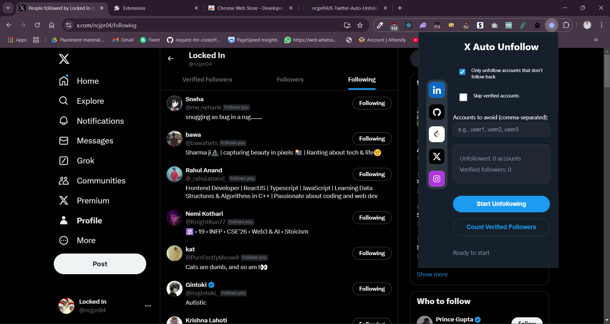
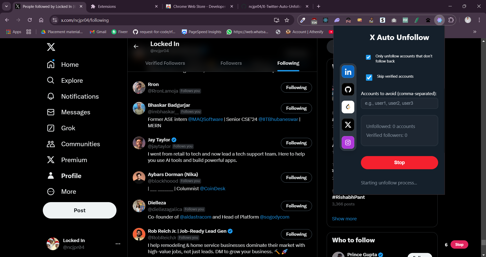

# Next.js X/Twitter Auto Unfollower 🚀

The **Next.js X/Twitter Auto Unfollower** is a Chrome extension that allows users to unfollow accounts on Twitter efficiently. Built with Next.js and React, this extension demonstrates the integration of modern web technologies into Chrome extension development.

## Table of Contents ✨
- [Installation](#Inststalltion)
- [Description](#description)
- [Installation](#installation)
- [Usage](#usage)
- [Contributing](#contributing)
- [License](#license)

# Installation
Please refer - https://www.loom.com/share/b2d48e9c1e48496fb0ddba5a6c5b7020?sid=2143abc8-aa4d-477f-80b3-00a73247edc8
# Description

The **Next.js X/Twitter Auto Unfollower** simplifies managing your Twitter following list. Whether you're looking to unfollow inactive accounts or streamline your timeline, this extension provides a user-friendly interface for automating the unfollow process directly within your browser.



# Installation

To install and run **Next.js X/Twitter Auto Unfollower** locally, follow these steps:

1. Clone this repository:

   ```bash
   git clone https://github.com/ncjpr04/X-Twitter-Auto-Unfollower.git
2. Navigate to the project directory:

   ```bash
   cd X-Twitter-Auto-Unfollower
3. Install the dependencies using npm:

   ```bash
   npm install

# Usage

To run the Next.js X/Twitter Auto Unfollower locally, follow these steps:

1. Run the project:
   ```bash
   npm run dev
This will run the project on your localhost.

You can access the project at: http://localhost:3000/

2. Build the project:
   ```bash
   npm run build
   
This will prepare the project and export it to create a new folder out/. It will also rename the _next folder to next (without the underscore).

3. Open Google Chrome and go to chrome://extensions.

4. Enable the "Developer mode" toggle switch at the top-right corner.

5. Click on "Load unpacked" and select the out folder generated by the build process.

6. The X/Twitter Auto Unfollower should now be loaded as an unpacked extension in Google Chrome.
   


# Contributing

Contributions to the Next.js X/Twitter Auto Unfollower are welcome! If you find any issues or have suggestions for improvements, please feel free to open an issue or submit a pull request.

# License

Permission is hereby granted, free of charge, to any person obtaining a copy of this software and associated documentation files (the "Software"), to deal in the Software without restriction, including without limitation the rights to use, copy, modify, merge, publish, distribute, sublicense, and/or sell copies of the Software, and to permit persons to whom the Software is furnished to do so, subject to the following conditions:

The above copyright notice and this permission notice shall be included in all copies or substantial portions of the Software.

THE SOFTWARE IS PROVIDED "AS IS", WITHOUT WARRANTY OF ANY KIND, EXPRESS OR IMPLIED, INCLUDING BUT NOT LIMITED TO THE WARRANTIES OF MERCHANTABILITY, FITNESS FOR A PARTICULAR PURPOSE AND NONINFRINGEMENT. IN NO EVENT SHALL THE AUTHORS OR COPYRIGHT HOLDERS BE LIABLE FOR ANY CLAIM, DAMAGES OR OTHER LIABILITY, WHETHER IN AN ACTION OF CONTRACT, TORT OR OTHERWISE, ARISING FROM, OUT OF OR IN CONNECTION WITH THE SOFTWARE OR THE USE OR OTHER DEALINGS IN THE SOFTWARE.
